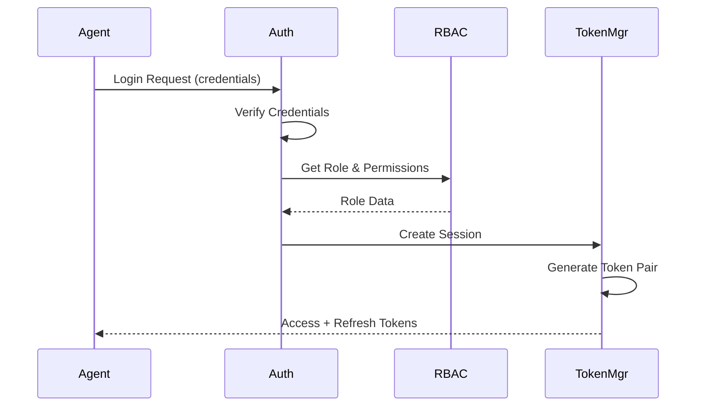
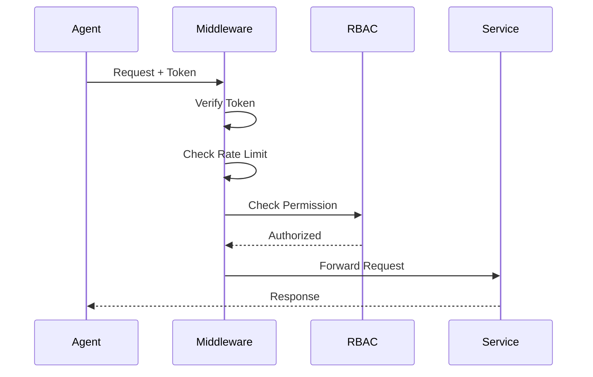
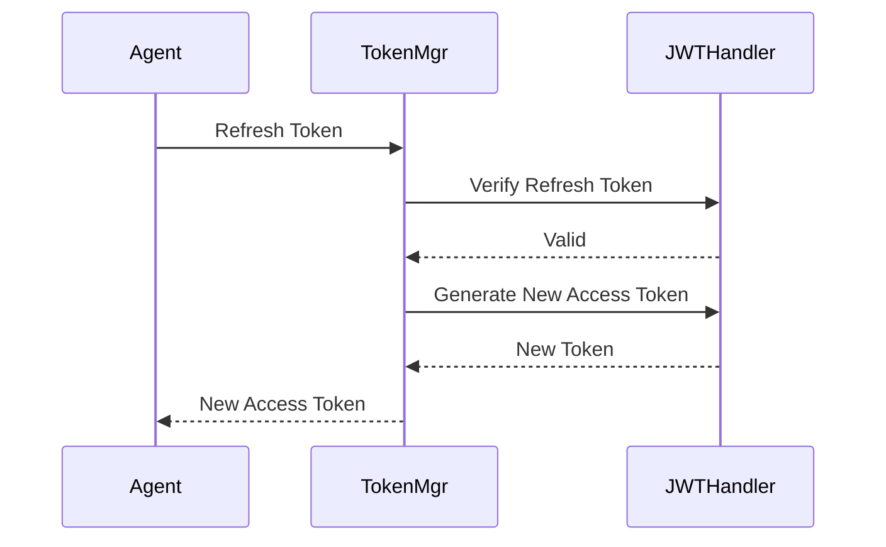

# Security Implementation Guide

## Overview

This document outlines the comprehensive security implementation for the RabbitMQ Multi-Agent Orchestration System, featuring JWT authentication, Role-Based Access Control (RBAC), message-level security, and complete token lifecycle management.

## Architecture Components

### 1. JWT Handler (`src/auth/jwt-handler.js`)

The JWT handler manages token generation, verification, and rotation with the following features:

#### Token Types
- **Access Tokens**: Short-lived tokens (15 minutes default) for API access
- **Refresh Tokens**: Long-lived tokens (7 days default) for obtaining new access tokens

#### Key Features
- Secure secret generation using crypto.randomBytes
- Token rotation support for enhanced security
- Token revocation tracking
- Automatic cleanup of expired tokens
- Support for custom token expiry times
- Token statistics and monitoring

#### Token Structure
```javascript
{
  agentId: "agent-uuid",
  agentType: "worker",
  role: "worker",
  permissions: ["task.receive", "task.execute", ...],
  sessionId: "session-uuid",
  jti: "token-id",
  type: "access|refresh",
  iat: timestamp,
  exp: timestamp,
  iss: "rabbitmq-orchestrator",
  aud: "agent-network"
}
```

### 2. RBAC Manager (`src/auth/rbac-manager.js`)

Comprehensive role-based access control system with hierarchical roles and fine-grained permissions.

#### Defined Roles

| Role | Priority | Description | Key Permissions |
|------|----------|-------------|-----------------|
| **admin** | 100 | Full system access | `system.*`, `agent.*`, `task.*` |
| **leader** | 80 | Team orchestration | `task.create`, `task.assign`, `brainstorm.initiate` |
| **specialist** | 70 | Domain expert | `task.execute.specialist`, `brainstorm.expert` |
| **collaborator** | 60 | Collaboration focus | `brainstorm.participate`, `task.collaborate` |
| **worker** | 50 | Task execution | `task.receive`, `task.execute`, `result.submit` |
| **observer** | 20 | Read-only access | `monitor.view`, `status.view` |

#### Permission System

##### Permission Format
```
resource.action[.subaction]
```

Examples:
- `task.create` - Create new tasks
- `task.execute.specialist` - Execute specialist-only tasks
- `brainstorm.*` - All brainstorm operations

##### Wildcard Support
- `*` - All permissions
- `resource.*` - All actions on a resource

##### Resource-Level Permissions
Agents can be granted permissions for specific resources:

```javascript
rbacManager.grantResourcePermission(
  agentId,
  'task-123',
  ['task.execute', 'task.modify']
);
```

#### Role Hierarchy
Roles can inherit permissions from other roles:
- Admin → Leader, Specialist, Collaborator, Worker, Observer
- Leader → Worker, Observer
- Specialist → Worker
- Collaborator → Observer

### 3. Authentication Middleware (`src/auth/middleware.js`)

Handles request authentication, authorization, and security enforcement.

#### Security Features

##### Rate Limiting
- Configurable request limits per agent
- Sliding window implementation
- Automatic reset after time window

##### Failed Attempt Tracking
- Maximum failed attempts before lockout
- Temporal lockout mechanism (15 minutes default)
- Automatic cleanup of old attempts

##### Message Signing
- HMAC-SHA256 message signatures
- Timestamp validation to prevent replay attacks
- Signature caching for performance

##### Identity Verification
- Multi-factor authentication support
- Agent secret validation using bcrypt
- Device/IP binding for enhanced security

### 4. Token Manager (`src/auth/token-manager.js`)

Complete token lifecycle management with session support.

#### Session Management
- Session creation with token pairs
- Maximum sessions per agent limit
- Session expiration and extension
- Session binding to device/IP

#### Token Lifecycle
1. **Creation**: Generate token pairs for new sessions
2. **Refresh**: Rotate tokens using refresh token
3. **Validation**: Verify token and session validity
4. **Revocation**: Invalidate tokens and sessions
5. **Cleanup**: Automatic removal of expired data

#### MFA Support
- Optional two-factor authentication
- Session upgrade after MFA verification
- Enhanced permissions for MFA-verified sessions

## Security Workflows

### 1. Agent Authentication Flow



### 2. Request Authorization Flow



### 3. Token Refresh Flow



## Integration with RabbitMQ

### Message Authentication

Every RabbitMQ message includes authentication headers:

```javascript
{
  properties: {
    headers: {
      'x-auth-token': 'jwt-token',
      'x-agent-id': 'agent-uuid',
      'x-signature': 'message-signature',
      'x-timestamp': timestamp
    }
  },
  content: {
    // Message payload
  }
}
```

### Authenticated Message Wrapper

```javascript
import authMiddleware from './src/auth/middleware.js';

// Wrap message with authentication
const authenticatedMessage = authMiddleware.wrapMessageWithAuth(
  message,
  authData
);

// Validate incoming message
const authContext = await authMiddleware.createAuthContext(
  rabbitMessage
);

if (!authContext.valid) {
  // Reject message
  channel.reject(message, false);
  return;
}
```

### Permission-Based Queue Access

```javascript
import rbacManager from './src/auth/rbac-manager.js';

// Check queue access permission
const canAccess = rbacManager.hasPermission(
  agentId,
  'queue.consume',
  { resourceId: queueName }
);

if (!canAccess) {
  throw new Error('Access denied to queue');
}
```

## Security Best Practices

### 1. Environment Configuration

All sensitive configuration should be in environment variables:

```bash
# JWT Configuration
JWT_ACCESS_SECRET=<random-64-byte-hex>
JWT_REFRESH_SECRET=<random-64-byte-hex>
JWT_ACCESS_EXPIRY=15m
JWT_REFRESH_EXPIRY=7d
JWT_ISSUER=rabbitmq-orchestrator
JWT_AUDIENCE=agent-network

# Security Settings
BCRYPT_ROUNDS=10
MESSAGE_SECRET_KEY=<random-32-byte-hex>
REQUIRE_MFA=false
TOKEN_BINDING=true
TOKEN_ROTATION=true

# Rate Limiting
RATE_LIMIT_WINDOW=60000
RATE_LIMIT_MAX=100

# Session Management
MAX_SESSIONS_PER_AGENT=5
SESSION_TIMEOUT=86400000

# Failed Attempts
MAX_FAILED_ATTEMPTS=5
LOCKOUT_DURATION=900000
```

### 2. Secret Management

- Generate strong, random secrets using crypto.randomBytes
- Never commit secrets to version control
- Rotate secrets regularly
- Use different secrets for different environments

### 3. Token Security

- Keep access tokens short-lived
- Implement token rotation for refresh tokens
- Track and revoke compromised tokens
- Clean up expired tokens regularly

### 4. Audit Logging

All security events are logged:

```javascript
const auditLog = rbacManager.getAuditLog({
  agentId: 'agent-123',
  action: 'permission_denied',
  startTime: Date.now() - 86400000
});
```

### 5. Rate Limiting

Implement rate limiting at multiple levels:
- Per-agent request limits
- Queue-specific limits
- Global system limits

### 6. Message Security

- Sign all messages with HMAC
- Validate timestamps to prevent replay
- Encrypt sensitive message content
- Verify agent identity on each message

## Usage Examples

### 1. Creating an Authenticated Agent

```javascript
import tokenManager from './src/auth/token-manager.js';
import rbacManager from './src/auth/rbac-manager.js';

// Assign role to agent
rbacManager.assignRole('agent-123', 'worker');

// Create session
const session = await tokenManager.createSession({
  agentId: 'agent-123',
  agentType: 'worker'
}, {
  userAgent: 'Agent/1.0',
  ipAddress: '192.168.1.100'
});

console.log('Access Token:', session.tokens.access.token);
console.log('Refresh Token:', session.tokens.refresh.token);
```

### 2. Authenticating Requests

```javascript
import authMiddleware from './src/auth/middleware.js';

// In message handler
async function handleMessage(message) {
  // Create auth context
  const authContext = await authMiddleware.createAuthContext(message);

  if (!authContext.valid) {
    console.error('Authentication failed:', authContext.error);
    return;
  }

  // Check permission
  const authorized = await authMiddleware.authorize(
    authContext.authData,
    'task.execute',
    { resourceId: message.content.taskId }
  );

  if (!authorized.authorized) {
    console.error('Authorization failed:', authorized.error);
    return;
  }

  // Process message
  processTask(message.content);
}
```

### 3. Implementing Protected Operations

```javascript
import rbacManager from './src/auth/rbac-manager.js';

class TaskService {
  // Using decorator pattern
  @rbacManager.requiresPermission('task.create')
  async createTask(context, taskData) {
    // Only agents with task.create permission can execute
    return await this.taskRepository.create(taskData);
  }

  // Using role requirement
  @rbacManager.requiresRole(['leader', 'admin'])
  async assignTask(context, taskId, agentId) {
    // Only leaders and admins can assign tasks
    return await this.taskRepository.assign(taskId, agentId);
  }
}
```

### 4. Refreshing Tokens

```javascript
import tokenManager from './src/auth/token-manager.js';

// Client-side token refresh
async function refreshAccessToken(refreshToken) {
  try {
    const result = await tokenManager.refreshSession(refreshToken);

    // Store new tokens
    localStorage.setItem('accessToken', result.tokens.access.token);
    if (result.tokens.refresh) {
      localStorage.setItem('refreshToken', result.tokens.refresh.token);
    }

    return result.tokens.access.token;
  } catch (error) {
    // Handle refresh failure - redirect to login
    console.error('Token refresh failed:', error);
    redirectToLogin();
  }
}
```

## Monitoring and Metrics

### Security Metrics

```javascript
import jwtHandler from './src/auth/jwt-handler.js';
import tokenManager from './src/auth/token-manager.js';
import authMiddleware from './src/auth/middleware.js';
import rbacManager from './src/auth/rbac-manager.js';

// Get comprehensive security stats
function getSecurityMetrics() {
  return {
    jwt: jwtHandler.getStats(),
    sessions: tokenManager.getStatistics(),
    middleware: authMiddleware.getStats(),
    rbac: rbacManager.getRoleStats(),
    events: tokenManager.getRecentEvents(100)
  };
}

// Monitor in real-time
setInterval(() => {
  const metrics = getSecurityMetrics();
  console.log('Active Sessions:', metrics.sessions.activeSessions);
  console.log('Failed Attempts:', metrics.middleware.failedAttempts);
  console.log('Rate Limited:', metrics.middleware.rateLimits);
}, 60000);
```

### Audit Trail

```javascript
// Get security audit trail
const auditTrail = rbacManager.getAuditLog({
  startTime: Date.now() - 86400000, // Last 24 hours
  action: 'permission_denied'
});

// Export for analysis
fs.writeFileSync(
  'security-audit.json',
  JSON.stringify(auditTrail, null, 2)
);
```

## Testing Security

### Unit Tests

See `tests/auth/` directory for comprehensive security tests:
- `jwt-handler.test.js` - JWT operations
- `rbac-manager.test.js` - RBAC functionality
- `middleware.test.js` - Authentication middleware
- `token-manager.test.js` - Token lifecycle

### Integration Tests

```javascript
// Example integration test
describe('Security Integration', () => {
  it('should enforce role-based access', async () => {
    // Create worker agent
    const workerSession = await tokenManager.createSession({
      agentId: 'worker-1',
      agentType: 'worker'
    });

    // Attempt leader operation
    const result = await authMiddleware.authorize(
      { ...workerSession, authenticated: true },
      'task.assign'
    );

    expect(result.authorized).toBe(false);
  });
});
```

## Security Checklist

- [ ] All secrets in environment variables
- [ ] JWT secrets are strong and random
- [ ] Token expiry times configured appropriately
- [ ] Rate limiting enabled
- [ ] Failed attempt tracking active
- [ ] Message signing implemented
- [ ] Audit logging configured
- [ ] Token cleanup scheduled
- [ ] RBAC roles properly assigned
- [ ] Resource permissions configured
- [ ] MFA enabled for sensitive operations
- [ ] Session binding implemented
- [ ] Token rotation enabled
- [ ] Security monitoring active
- [ ] Regular security audits scheduled

## Troubleshooting

### Common Issues

1. **Token Expired**
   - Check token expiry settings
   - Ensure refresh token flow works
   - Verify system time synchronization

2. **Permission Denied**
   - Check agent role assignment
   - Verify permission requirements
   - Review audit logs

3. **Rate Limit Exceeded**
   - Adjust rate limit settings
   - Implement backoff strategy
   - Check for request loops

4. **Session Not Found**
   - Verify session creation
   - Check session expiration
   - Review cleanup intervals

## Future Enhancements

1. **OAuth2/OpenID Connect Integration**
2. **Hardware Token Support**
3. **Biometric Authentication**
4. **Zero-Trust Network Architecture**
5. **Encrypted Message Payloads**
6. **Distributed Session Store (Redis)**
7. **Certificate-Based Authentication**
8. **Dynamic Permission System**
9. **AI-Based Threat Detection**
10. **Compliance Reporting (SOC2, GDPR)**

## Conclusion

This security implementation provides enterprise-grade authentication and authorization for the RabbitMQ Multi-Agent Orchestration System. The modular design allows for easy extension and customization while maintaining strong security practices.